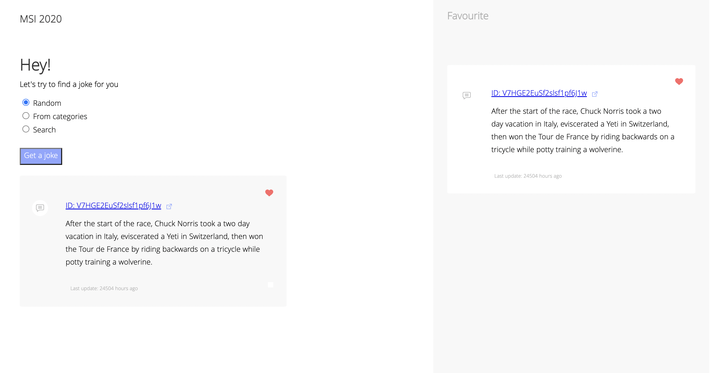

 

<!-- PROJECT LOGO -->
 

  

<h3 align="center">Chuck Norris Jokes Generator</h3>

  

    project_description
     
    <a href="https://github.com/darynatkm/ChuckNorrisJokesGenerator"><strong>Explore the docs »</strong></a>
     
     
    <a href="https://github.com/darynatkm/ChuckNorrisJokesGenerator">View Demo</a>
    ·
    <a href="https://github.com/darynatkm/ChuckNorrisJokesGenerator/issues">Report Bug</a>
    ·
    <a href="https://github.com/darynatkm/ChuckNorrisJokesGenerator/issues">Request Feature</a>
  

<!-- ABOUT THE PROJECT -->
## About The Project

The app is created with Chuck Norris Jokes Generator API to display jokes chosen randomly, by category or by a keyword entered in the search bar. The liked jokes can be added to favorites panel and they will be kept for the future. Once the joke is no longer interesting it can be removed from the favorites panel. 

(<a href="#readme-top">back to top</a>)

### Built With

<a href="https://www.theChuckNorrisJokesGenerator.org/documentation/api">ChuckNorrisJokesGenerator</a>

<!-- CONTACT -->
## Contact

Daryna Tokmachova  - darynatokmachova@gmail.com

Project Link: [https://github.com/darynatkm/ChuckNorrisJokesGenerator](https://github.com/darynatkm/ChuckNorrisJokesGenerator)